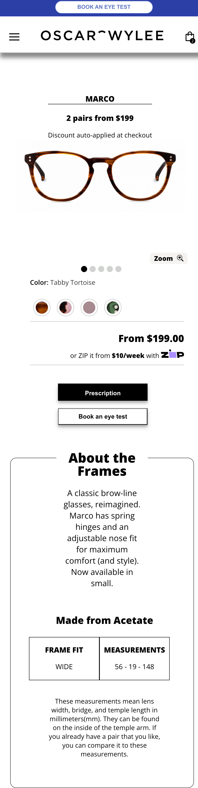
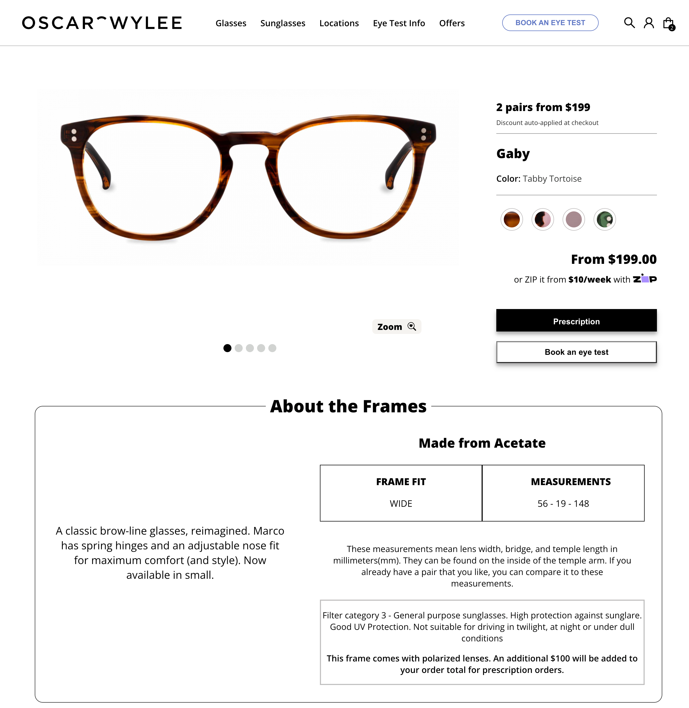

# Oscar Wylee

###### This is a take home test of Oscar Wylee's interview

- I used React and vanilla CSS to finish this test
- Responsive desgin: Desktop view and Mobile view.
- Hosted on Heroku: https://oscar-wylee.herokuapp.com/

## Screenshots




## TO-DO list

- There can be a tablet view.
- Though the test does not require me to make it dynamic, but I think it is cool to finish this simple webpage with some javascript as well-especially for the hamburger icon.
- Some css logic can be refined.
- Due to the time, the file structure is really bad, I will fix it up once I have a chance.

## Installation

You can either `clone` or dowoload the zip file.
Install the dependencies and devDependencies and start the server.

```sh
npm install
```
